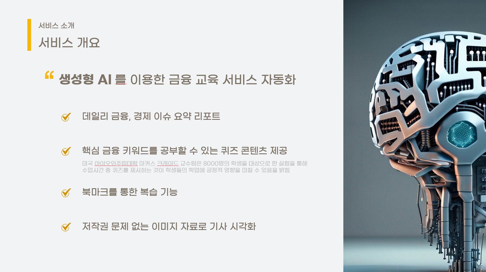
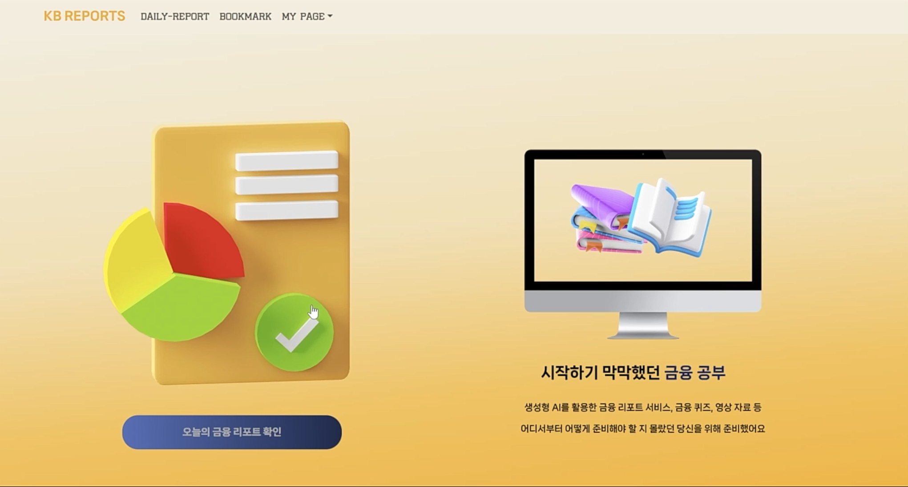
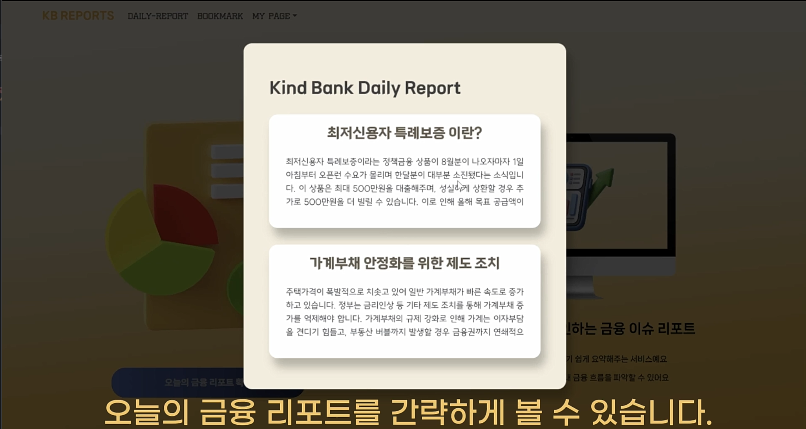
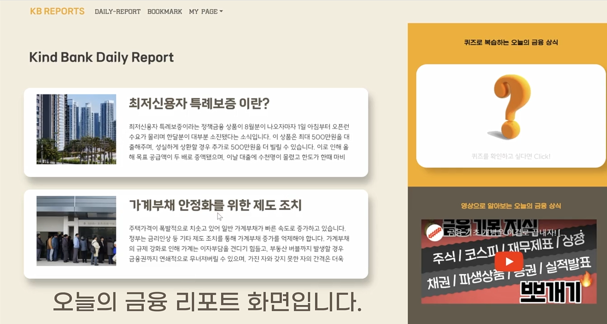
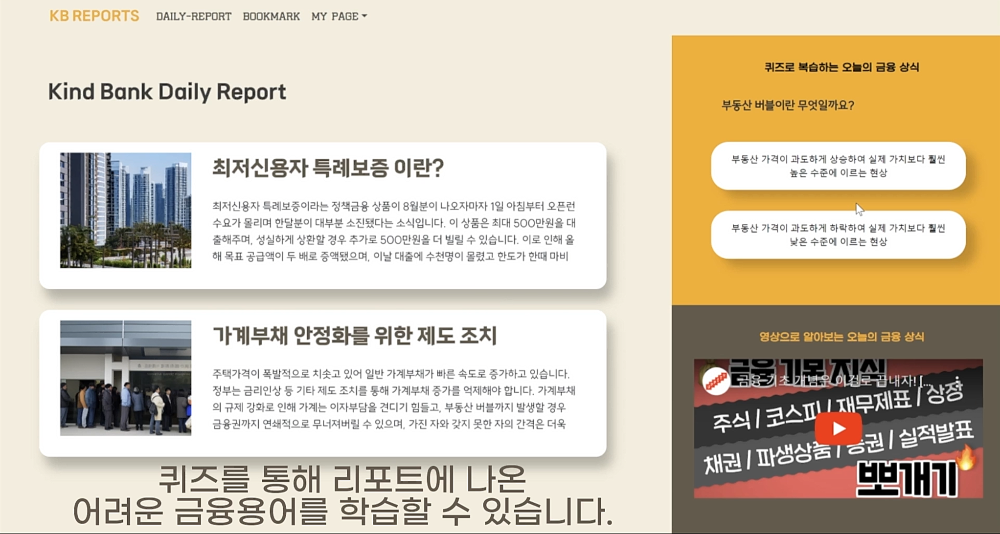
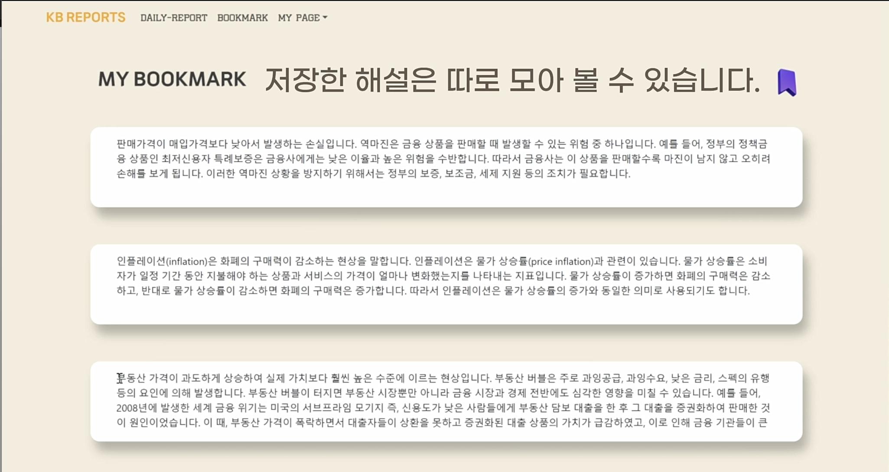
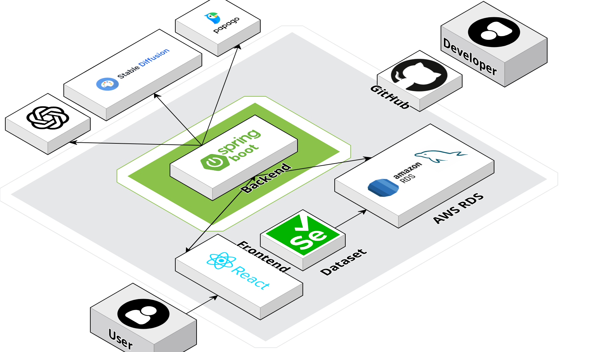

# 📜 Kind Bank Reports

## 당신의 금융 지식을 밝혀주는 파트너🔦

 

## 🎦 소개 영상

 

---

## 🎦 프로젝트 진행 기간

2023.07.31 ~ 2023.08.20

 

---

 

## 🎦 배경

2022년 기준 전 국민 금융 이해력 조사 결과 29세 이하, 60대 이상의 국민들이 OECD 최소 목표 점수에 도달하지 못하는 것으로 밝혀졌습니다.
금융 교육 부재로 인한 '금융 문맹'이 발생하고, 금융 문맹층을 대상으로 금융 사기가 급증하며 금융 교육의 필요성이 지속적으로 제기되고 있습니다.
하지만, 기존 금융 교육 서비스는 시공간 제약, 자원 문제 등 다양한 한계로 효과가 미미한 상황입니다.

 

이러한 상황에서 연령, 학력, 소득에 구애받지 않고 모든 사람에게 평등한 금융 교육의 기회를 제공하고자 Kind Bank Reports 서비스를 만들게 되었습니다.

 

---

 

## 🎦 기능 설명

 

### ⬛ 생성형 AI를 이용한 금융 교육 서비스 자동화

#### ✅ 메인화면

✔️ 메인화면입니다.  
✔️ 리포트 아이콘 클릭 시 오늘의 금융 소식을 한 눈에 확인할 수 있는 모달창이 뜹니다.  

✔️ 우측에는 처음 서비스를 이용하는 사람들을 위한 안내가 슬라이드로 나타납니다  
✔️ '오늘의 금융 리포트 확인'을 누르면 리포트 디테일 페이지로 이동합니다.  

 
 
 

#### ✅ 기능1. 금융 리포트 디테일 페이지

✔️ gpt-3.5를 이용하여 오늘 금융 이슈를 요약 한 다음 사용자에게 알려줍니다.  
✔️ Stable Diffusion을 이용하여 오늘 금융 이슈를 시각화 한 다음 사용자에게 알려줍니다.  
✔️ 오늘의 금융 이슈와 관련된 교육 영상을 함께 보여주어 보충 학습을 도와줍니다. 

 
 
 

#### ✅ 기능2. 퀴즈 학습

✔️ 핵심 금융 키워드를 공부할 수 있는 퀴즈 콘텐츠 제공합니다. 
✔️ 퀴즈를 풀면 해설이 제공되며 해설을 북마크 할 수 있습니다. 
 
 
 

#### ✅ 기능3.

✔️ 북마크를 통해 이전 금융지식을 복습할 수 있습니다. 

 
 
 

---

 

## ✅ 사용 기술
 
 
  
 
 
 
 
 
 

  

---

  

## ✅ 시스템 구성도

  

---

 

## ✅ 협업툴

  
  
  

 

---

 

## ✅ 협업 환경

### GitHub
- 프로젝트 시작 전 커밋 컨벤션을 정한 후 협업

    

        
 커밋컨벤션 

        💙메세지
            - ⭐ FEAT : #이슈번호 새로운 기능에 대한 커밋
            - 🛠 FIX : #이슈번호 버그 수정에 대한 커밋
            - 📝 UPDATE : #이슈번호 파일 내용 수정에 대한 커밋
            - 🧱 BUILD : #이슈번호 빌드 관련 파일 수정에 대한 커밋 
            - ⚒ REFACT : #이슈번호 코드 리팩토링에 대한 커밋
            - 🎨 DESIGN: #이슈번호 CSS 등 사용자 UI 디자인 변경
            - ✏ DOCS : #이슈번호 문서 수정에 대한 커밋
            - 💬 COMMENT : #이슈번호 필요한 주석 추가 및 변경
            - 🔙 RENAME : #이슈번호 파일 혹은 폴더명을 수정하거나 옮기는 작업만인 경우
            - ✂ REMOVE : #이슈번호 파일을 삭제하는 작업만 수행한 경우
            - 👏 CHORE : #이슈번호 그 외 기타 수정에 대한 커밋
        

        💚merge 컨벤션
            # Feature Request
                - Part
                - [ ] FE
                - [ ] BE
                - 기능 상세 설명
                - 기능에서 어떤 부분이 구현되어야 하는 지 설명해주세요
    

 

- 프론트엔드, 백엔드로 나누어 진행

 

### Notion
- 문서화가 필요한 자료 기록
- 간트차트 작성
- 회의록 작성
- 참고자료 업로드
- 기능구현 현황 파악

 

---

## ✅ 역할분담

❤️ Front-end : 최다혜 ❤️
❤️ Back-end : 최은녕 ❤️
